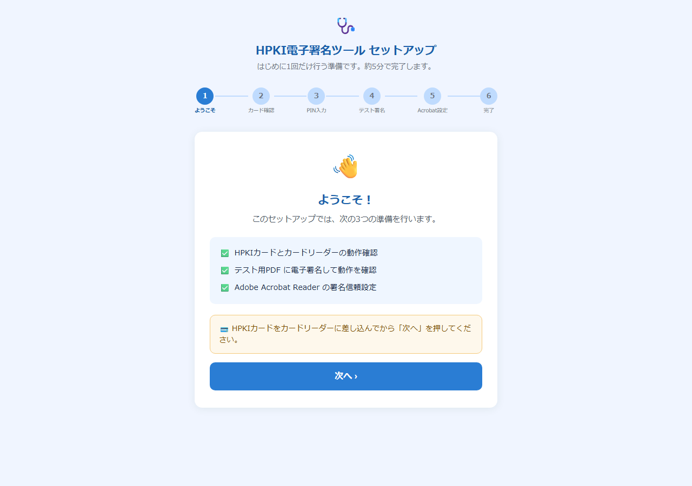
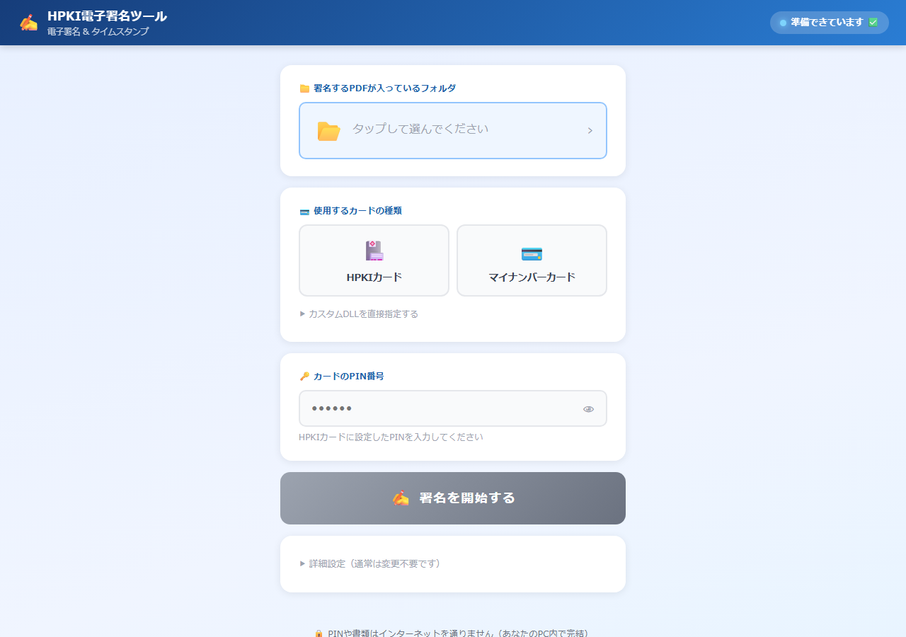
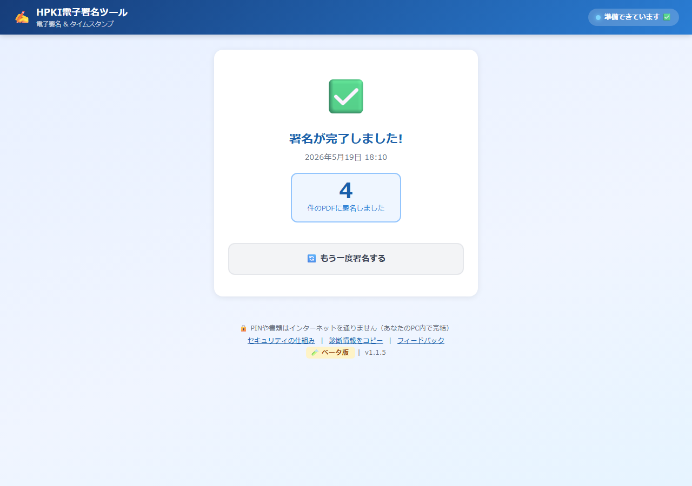

# HPKI 電子署名ツール インストールガイド

医療・介護現場の皆様向け・**最新版に対応**

このガイドは、お手元のパソコンに「HPKI 電子署名ツール」を導入するための手順書です。
**所要時間：30〜60分**（カードリーダーの準備時間を含む）

---

## 📋 事前にご用意いただくもの

### 物理機材

- 🖥 **Windows 10 または 11 のパソコン**（64bit）
- 🌐 **Google Chrome または Microsoft Edge（最新版）**
  - ⚠️ Firefox / Safari は対応していません（フォルダ選択機能が未実装のため）
- 💳 **電子カード**（次のいずれか）
  - HPKIカード（医師・看護師カード）
  - マイナンバーカード（署名用パスワード：英数字 6〜16桁）
- 🔌 **ICカードリーダー**
  - 推奨：**サンワサプライ ADR-MNICU2**（約 ¥7,040、Amazon や量販店で購入可）
  - その他、PC/SC 規格対応のリーダーでも概ね動作します

### インターネット環境

- 初回インストール時のみ必要（約 30 MB ダウンロード）
- 普段の署名作業はオフラインでも可能

### 必要なソフトウェア（後で案内されます）

- カードリーダーのドライバ（リーダー購入時に同梱、または公式ダウンロード）
- 公的個人認証サービス利用者クライアントソフト（マイナンバー利用時）
- HPKI クライアントソフト（HPKI 利用時、カード発行時に同梱）
- Adobe Acrobat Reader（無料・署名検証用）

---

## 🚀 インストール手順

### ステップ 1：インストーラのダウンロード

1. ブラウザで以下のページを開きます

   <https://github.com/lifemate-inc/hpki-signer/releases/latest>

2. 「Assets」（添付ファイル）の中から **`hpki-signer-setup-X.X.X.exe`**（約 4 MB）をクリックしてダウンロード

3. ダウンロードフォルダ（通常は「ダウンロード」）に保存されます

### ステップ 2：インストーラを実行

1. `hpki-signer-setup-X.X.X.exe` をダブルクリック

2. **「Windowsによって PC が保護されました」**という警告が表示される場合があります
   - 「**詳細情報**」をクリック
   - 「**実行**」をクリック

   > 新しく公開されたソフトウェアによく表示される警告です。本ツールはオープンソースとして公開しており、ソースコードも GitHub で公開されています。

3. インストールウィザードに従って「次へ」をクリック

4. インストール先：**自動で適切な場所**に配置されます（変更不要）

5. インストール完了 → 「起動する」にチェックを入れて「完了」

### ステップ 3：必要な追加ソフトの確認

ツールが起動すると、ブラウザが自動的に開き、**セットアップウィザード**が立ち上がります。

ステップ 1 の画面で、現在のパソコン環境を自動チェックします：

| 項目 | 説明 |
|------|------|
| ① **カードリーダー** | 接続された IC カードリーダーを検出 |
| ② **JPKI 利用者ソフト** | マイナンバーカードを使う場合に必要 |
| ③ **HPKI クライアントソフト** | HPKI カードを使う場合に必要 |

すべて ✅ 緑色になっていれば次に進めます。

#### もし ❌ 赤色だったら

**カードリーダーが未検出の場合：**

1. リーダーを USB に差し直す
2. 画面の「📥 ドライバーをダウンロード」をクリック
3. メーカー公式ページからドライバを取得・展開し、`Setup.exe` を実行
4. パソコンを再起動
5. セットアップ画面に戻って「もう一度確認」

**JPKI 利用者ソフトが未インストールの場合：**

1. 画面の「📥 J-LIS 公式：JPKI 利用者ソフトをダウンロード」をクリック
2. J-LIS 公式ページから利用者ソフト（無料）をダウンロード・インストール
3. パソコンを再起動
4. セットアップ画面に戻って「もう一度確認」

**HPKI クライアントソフトが未インストールの場合：**

1. HPKI カード発行時に同梱されている CD/USB 内のソフトをインストール
2. お持ちでない場合は、発行元（医師会・看護協会など）にお問い合わせください
3. インストール後、パソコンを再起動

### ステップ 4：PIN 入力 & テスト署名

1. カード種別を選択（HPKI カード または マイナンバーカード）

2. カードリーダーに**カードをセット**（カチッと音がするまで）

3. **PIN** を入力
   - HPKI カード：通常 4〜8 桁の数字
   - マイナンバーカード（署名用）：**英数字 6〜16 桁**

4. 「**テスト署名を実行する**」をクリック

5. 数秒で「✅ テスト署名が成功しました」と表示されれば成功

### ステップ 5：Acrobat の信頼設定

最後に、Adobe Acrobat Reader で署名を**緑のチェックマーク**で表示するための一回限りの設定です。

#### マイナンバーカードの場合

1. セットアップ画面の「📥 Windows 証明書ストアにインストール」をクリック
2. 完了したら Acrobat を開く
3. メニュー「編集」→「環境設定」→「署名」
4. 「確認」の「詳細...」ボタン
5. 「Windows 統合」セクションで以下に**両方**チェック：
   - ☑ 署名の検証時に、Windows 証明書ストアでのすべてのルート証明書を信頼する
   - ☑ 証明済み文書を検証時に、Windows 証明書ストアでのすべてのルート証明書を信頼する
6. 「OK」を 2 回押して Acrobat を一度終了

#### HPKI カードの場合

詳細は <https://lifemate-inc.github.io/hpki-signer/setup.html> のステップ 5 の手順をご覧ください。

---

## 📝 普段の使い方

セットアップが完了したら、これからは：

1. **デスクトップの「HPKI 電子署名ツール」アイコン**をダブルクリック

2. 数秒待つとブラウザが開きます

3. カード種別を選び PIN を入力

   

4. 「**フォルダを選択**」で署名したい PDF のあるフォルダを指定

5. 「**署名を開始する**」をクリック

   

6. 一括署名が完了

   

---

## 🚨 困ったときは

### よくあるご質問

**Q. インストーラがダウンロードできない**

ブラウザのセキュリティ設定で「危険なファイル」と表示される場合があります。
「破棄」の隣の「**保持**」ボタンを選んでください。

**Q.「カードリーダーが見つかりません」と表示される**

1. リーダーを別の USB ポートに差し替える
2. USB ハブを介さず、パソコンに直接つなぐ
3. パソコンを再起動
4. ドライバを再インストール

**Q.「PIN が違います」と表示される**

- HPKI カード：通常 4〜8 桁の数字
- マイナンバーカード（**署名用**）：英数字 6〜16 桁（4 桁の利用者用 PIN とは別物）
- **間違え続けるとカードがロックされます**（マイナンバーカードの場合 5 回でロック）

**Q. Acrobat で「署名は無効」と表示される**

ステップ 5 の信頼設定が完了していない可能性があります。
Acrobat を一度終了して再起動してから、署名済み PDF を開いてください。

**Q.「ブリッジに接続できません」と表示される**

ツールのバックグラウンドサービスが起動していません。
デスクトップのアイコンからもう一度起動してください。

**Q. アンインストールしたい**

スタートメニュー「HPKI 電子署名ツール」フォルダの「アンインストール」を実行してください。

### お問い合わせ

導入支援・操作の質問・バグ報告は下記までメールでお寄せください。

📧 **michael@life-mate.jp**（件名に「【HPKI署名ツール】」を含めてください）

技術的な詳細をお持ちの方は GitHub Issues もご利用いただけます：

📋 <https://github.com/lifemate-inc/hpki-signer/issues>

---

## 🔒 セキュリティについて

本ツールは「**PIN や PDF をインターネットに送らない**」設計です。詳細は：

<https://lifemate-inc.github.io/hpki-signer/security.html>

---

## 📜 ライセンス

MIT License（オープンソース）

商用・非商用を問わずご自由にご利用いただけます。
医療・介護に携わる皆様のお役に立てれば幸いです。

---

**最新版：** <https://lifemate-inc.github.io/hpki-signer/install-guide.html>

**改訂履歴：**
- 2026-05-19 公開ベータ版（v1.1.6）対応
