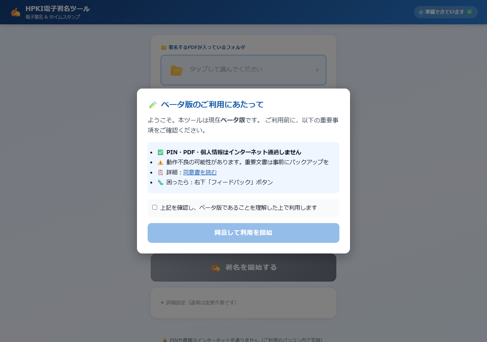

# 困ったときの簡単対応

「うまく動かない」と感じられたときに、まずお試しいただける対処を書いています。

3 つ試して改善しない場合は、**遠慮なくお問い合わせください**。

---

## まず深呼吸

慌てなくて大丈夫です。**データは消えません**。

パソコンを再起動するだけで直ることが多いです。

---

## 症状別の対処

### 🔴 アイコンをクリックしても何も起きない

**お試しください**：

1. もう一度ダブルクリック（早すぎた可能性）
2. パソコンを再起動
3. デスクトップにアイコンが実際にあるかご確認ください

それでも改善しない場合：**お問い合わせください**

### 🔴 ブラウザが開いたけれど「ブリッジに接続できません」

下のような画面が出ている状態です：



**お試しください**：

1. 10 秒待ってから F5（ページ更新）
2. デスクトップアイコンをもう一度クリック
3. パソコンを再起動

それでも改善しない場合：**お問い合わせください**

### 🔴 「カードリーダーが見つかりません」

**お試しください**：

1. USB に差し直す（カチッとつなぐ)
2. 別の USB ポートに差す
3. パソコンを再起動
4. 画面の「📥 ドライバーをダウンロード」を試す

それでも改善しない場合：**お問い合わせください**

### 🔴 「PIN が違います」

⚠️ **STOP！3 回連続で間違えると、カードがロックされる可能性があります**

**ご確認ください**：

- 数字の `0`（ゼロ）と `O`（オー）を間違えていませんか
- 大文字と小文字
- スペースが入っていませんか

**PIN がわからなくなったら**：

- マイナンバーカード → **市区町村窓口へ**
- HPKI カード → **発行元（医師会・看護協会など）へ**

⚠️ **推測で入力しないでください**

### 🔴 ブラウザが開かない

**お試しください**：

1. デスクトップアイコンをもう一度クリック
2. 既にブラウザで開いていないかご確認（タブ）
3. パソコンを再起動

### 🔴 「最新版あり」と出続ける

**お試しください**：

1. デスクトップアイコンをダブルクリック
2. ブラウザを完全に閉じる（×ボタンを全部押す）
3. もう一度デスクトップアイコンをダブルクリック

それでも改善しない場合：**お問い合わせください**

### 🔴 「アップデートに失敗しました」と表示

これは**システムの保護機能**が働いて、自動で前のバージョンに戻った状態です。

**やること**：

1. **そのまま使い続けて OK**（古い版ですが動きます）
2. 配布元へご連絡（自動報告される予定）
3. 修正版が出るのをお待ちください

### 🔴 署名はできたけれど、PDF を開くと「無効」と表示

これは **Adobe Acrobat Reader の設定**の問題です。

**お試しください**：

1. PDF を一度閉じる
2. Acrobat Reader を完全に終了
3. もう一度 PDF を開く

それでも改善しない場合：**お問い合わせください**（一緒に設定を直しましょう）

### 🔴 動作がとても遅い

**お試しください**：

1. 他のアプリを閉じる
2. パソコンを再起動
3. ファイル数が多すぎないか確認（一度に 100 個など）

---

## 「診断情報をコピー」をご活用ください

何が起きているかわからないとき、**画面の一番下**にある：

```
🔒 セキュリティの仕組み | 📋 診断情報をコピー | 💬 フィードバック
```

の **「📋 診断情報をコピー」** をクリック！

```
↓ クリック後 ↓

「✅ 診断情報をコピーしました。
   メールや LINE で送ってください。」と表示されます。
```

そのまま：

- メールの本文に **貼り付け（Ctrl+V）**
- LINE のメッセージに**長押し → 貼り付け**

これを配布元へ送ってください。**原因がすぐにわかります**。

---

## お問い合わせ方法

困ったときは以下のいずれかでご連絡ください：

### 配布元の担当窓口（メール）

📧 **michael@life-mate.jp**

- 件名に「【HPKI署名ツール】」を含めていただくと、優先対応します
- 通常は **1営業日以内**に返信します
- 緊急（業務が止まる・データが消えそう等）の場合は、件名先頭に「【緊急】」を付けてください → **24時間以内**に一次返信します

### GitHub Issues（技術的な問題向け）

技術的な詳細をお持ちの方は、以下から Issue を作成いただけます：

📋 <https://github.com/lifemate-inc/hpki-signer/issues>

### お送りいただきたい情報

- **症状**（何をしたら、どうなったか）
- **画面の「📋 診断情報をコピー」**で取得した内容（メール本文に貼り付け）
- **可能であればスクリーンショット**（任意）

---

## 「困った」と感じたらいつでもご連絡ください

「**こんなことで連絡していいのかな？**」と思われた内容でも、**遠慮なくご連絡**ください。

ベータテストにご協力いただいている皆様の声を**最優先**で対応します。

ささいなことでも、**他の事業所様も同じことで困っている可能性が高い**ので、
お教えいただけると大変助かります。

---

最終更新: 2026-05-19
