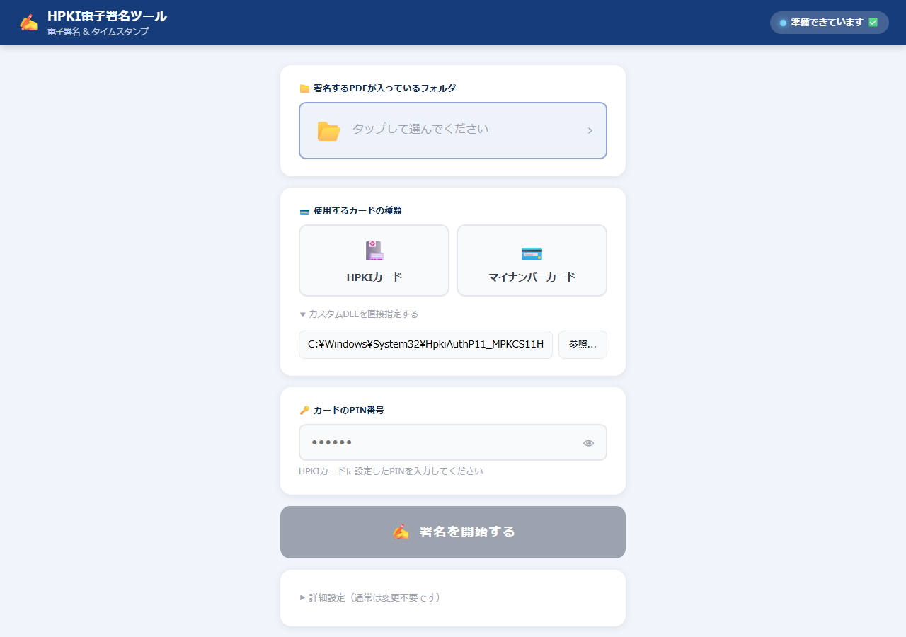
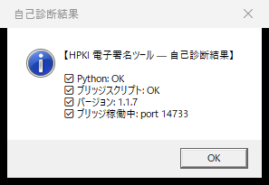

# 詳細インストール手順（技術仕様）

「**裏側で何が起きているのか**」を理解しながらインストールしたい IT 担当者向けの詳細ガイドです。

---

## 前提条件

| 項目 | 要件 |
|------|------|
| OS | Windows 10 / 11 (64bit) |
| 権限 | 通常ユーザー（**管理者権限不要**） |
| 空き容量 | 200 MB 以上 |
| インターネット | インストール時のみ必要（30 MB DL） |
| ICカードリーダー | PC/SC 規格対応（推奨：ADR-MNICU2） |
| ブラウザ | **Chrome または Edge（最新版）** ※ Firefox / Safari は フォルダ選択 API（`showDirectoryPicker`）非対応のため使用できません |

---

## インストールフロー（裏側で起きていること）

### Step 1: インストーラ実行

```
hpki-signer-setup-X.Y.Z.exe をダブルクリック
   ↓
SmartScreen 警告（コード署名なしのため）
   → 「詳細情報」→「実行」
   ↓
Inno Setup 製ウィザード起動
   ↓
インストール先選択（既定: %LOCALAPPDATA%\HpkiSigner）
   ↓
Inno Setup の Code セクションが GitHub Releases API を叩く
   ↓
payload-X.Y.Z.zip (約26MB) を DL
   ↓
PowerShell の Expand-Archive で展開
   ↓
ショートカット作成・レジストリ登録
   ↓
インストール完了 → launcher.exe 自動起動
```

### Step 2: 初回起動

```
launcher.exe 起動
   ↓
launcher.json 読み込み（なければデフォルト）
   ↓
_pending/.ready が無いことを確認
   ↓
ポート 14733-14737 から空きを探す
   ↓
python.exe bridge\bridge.py を CREATE_NO_WINDOW で起動
   ↓
HPKI_BRIDGE_PORT 環境変数で port を渡す
   ↓
最大60秒待って http://127.0.0.1:PORT/api/health に成功するまでpolling
   ↓
ブラウザを http://localhost:PORT/ で開く
   ↓
launcher.exe は終了
```

### Step 3: Bridge 起動時の処理

```python
# bridge.py 起動時の流れ
1. sys.path に bridge ディレクトリを追加（embed Python のため必要）
2. PORT = HPKI_BRIDGE_PORT env var or 14733
3. CSRF_TOKEN = secrets.token_urlsafe(32)
4. SHUTDOWN_TOKEN = secrets.token_urlsafe(32) → appDir/.shutdown_token に書く
5. allowed_origins.txt 読み込み → ALLOWED_ORIGINS set
6. _detect_all_libs() で HPKI/JPKI DLL を _KNOWN_PKCS11_LIBS の中から探す
7. Flask app.run(host='127.0.0.1', port=PORT)
```

---

## レジストリ・ファイルシステムへの影響

### レジストリに書かれるもの

| キー | 内容 |
|------|------|
| `HKCU\Software\Microsoft\Windows\CurrentVersion\Uninstall\{E7A2C8F3-...}_is1` | アンインストール情報 |

**管理者権限不要**のため HKLM には書きません。

### ファイルシステムへの影響

| 場所 | 内容 | 削除タイミング |
|------|-----|--------------|
| `%LOCALAPPDATA%\HpkiSigner\` | プログラム本体・ログ・設定 | アンインストール時 |
| `%USERPROFILE%\Desktop\HPKI電子署名ツール.lnk` | デスクトップショートカット | 同上 |
| `%APPDATA%\Microsoft\Windows\Start Menu\Programs\HPKI電子署名ツール\` | スタートメニュー | 同上 |

### **他には書きません**

- システム DLL を置き換えない
- グローバル PATH を変えない
- スタートアップに登録しない
- BCD（ブート設定）に触らない

---

## サイレントインストール（マスデプロイ向け）

複数台に一括でインストールする場合：

```powershell
# サイレントモード（ウィザード非表示・全自動）
hpki-signer-setup-1.1.8.exe /SILENT /SUPPRESSMSGBOXES /NORESTART

# 完全サイレント（プログレスバーも非表示）
hpki-signer-setup-1.1.8.exe /VERYSILENT /SUPPRESSMSGBOXES /NORESTART

# インストール先を指定
hpki-signer-setup-1.1.8.exe /SILENT /DIR="C:\Tools\HpkiSigner"

# デスクトップショートカット作成しない
hpki-signer-setup-1.1.8.exe /SILENT /TASKS="!desktopicon"

# ログ取得
hpki-signer-setup-1.1.8.exe /SILENT /LOG="C:\install.log"
```

**注意**: SILENT モードでは Inno Setup の DownloadPage が表示されないため、
payload の DL が失敗する可能性があります。マスデプロイは将来検証してください。

---

## クライアントソフトのインストール

### JPKI 利用者ソフト（マイナンバーカード用）

公式: <https://www.jpki.go.jp/download/>

```
1. 「Windows用 利用者クライアントソフト」をDL
2. インストーラ実行（管理者権限必要）
3. PC 再起動
4. C:\Program Files\JPKI\JPKIPKCS11Sign64.dll が配置されることを確認
```

DLL の自動検出に失敗した場合、メイン画面の「カスタムDLLを直接指定する」から
手動でパスを指定できます:



サイレントインストール：

```powershell
JPKIAppli01-03-05.exe /S
```

（バージョンによっては引数が違うので、J-LIS に確認）

### HPKIクライアントソフト

カードに同梱されている CD/USB or 発行元（医師会・看護協会）から取得。

ベンダーによって配布形式が違うため、個別に対応。

---

## カードリーダーのドライバ

ほとんどの PC/SC 対応リーダーは Windows 10/11 標準ドライバで動きますが、
ベンダー固有ドライバが必要な場合：

### ADR-MNICU2 (サンワサプライ)

公式: <https://www.sanwa.co.jp/support/download/dl_driver_ichiran?code=ADR-MNICU2>

サイレントインストール対応の場合：

```powershell
adr-mnicu2_w2.1.0.0\setup.exe /S
```

---

## バックアップとリストア

### 「設定だけ」バックアップ

```powershell
# 保持されるべき設定をコピー
Copy-Item "$env:LOCALAPPDATA\HpkiSigner\bridge\allowed_origins.txt" "C:\Backup\"
Copy-Item "$env:LOCALAPPDATA\HpkiSigner\launcher.json" "C:\Backup\" -ErrorAction SilentlyContinue
```

### 「PC全体」を引っ越すとき

1. 上記設定ファイルをバックアップ
2. 新PCに HPKI Signer をインストール
3. 設定ファイルを `%LOCALAPPDATA%\HpkiSigner\` に配置
4. カード・カードリーダーを物理的に移動

---

## アンインストール手順

### GUI で

```
スタートメニュー → 「HPKI電子署名ツール」フォルダ → 「アンインストール」
```

### コマンドで

```powershell
& "$env:LOCALAPPDATA\HpkiSigner\unins000.exe" /SILENT
```

### 完全クリーンアップ

```powershell
# アンインストーラを実行
& "$env:LOCALAPPDATA\HpkiSigner\unins000.exe" /VERYSILENT

# 残ったファイルを削除（ログ等）
Remove-Item "$env:LOCALAPPDATA\HpkiSigner" -Recurse -Force -ErrorAction SilentlyContinue

# レジストリは Inno Setup が自動で消す
```

JPKI / HPKI クライアントソフトとカードリーダードライバは別途残ります（他のソフトでも使うため）。

---

## 動作確認（インストール後）

### 1. プロセスチェック

```powershell
Get-Process python | Where-Object { $_.Path -like "*HpkiSigner*" }
netstat -ano | Select-String ":14733.*LISTENING"
```

### 2. API 動作確認

```powershell
Invoke-WebRequest "http://localhost:14733/api/health" | ConvertFrom-Json
```

期待される応答：
```json
{
  "version": "1.1.8",
  "mockMode": false,
  "availableLibs": [
    {"label": "HPKIカード", "type": "hpki", "path": "..."},
    {"label": "マイナンバーカード", "type": "jpki", "path": "..."}
  ],
  "csrfToken": "...",
  ...
}
```

### 3. Self-check

```powershell
& "$env:LOCALAPPDATA\HpkiSigner\launcher.exe" --check
```

MessageBox で診断結果が表示されます。



すべての項目が ✅ になっていれば正常です。

---

最終更新: 2026-05-20 (v1.1.7 対応)
